# Timecatcher

Final Project Work in Web Engineering @FHNW
 

#### Table of Contents
- [General](#general)
    - [Team Members](#team-members)
    - [Timecatcher Description](#timecatcher-description)
    - [Functionalities: Brief Description](#functionalities-brief-description)
        - [Register](#register)
        - [Login](#login)
        - [Project Overview](#project-overview)
        - [Create Project](#create-project)
        - [Profile](#profile)
        - [Modify Project](#modify-project)
        - [Email](#email)
        - [PDF](#pdf)
- [Use Cases](#use-cases)
    - [UC-1 Register/Login](#uc-1-register-and-login)
    - [UC-2 Project Overview](#uc-2-project-overview)
    - [UC-3 Create Project](#uc-3-create-project)
    - [UC-4 Profile](#uc-4-profile)
    - [UC-5 Modify Project](#uc-5-modify-project)
- [Design](#design)
    - [Information Systems Modelling](#information-systems-modelling)
    - [Information Systems (Layering) Architecture](#information-systems-layering-architecture)
- [Database](#database)
    - [Entity Relationship Diagram (ERD)](#entity-relationship-diagram-erd)
        - [SQL Table: user](#sql-table-user)
        - [SQL Table: authtoken](#sql-table-authtoken)
        - [SQL Table: project](#sql-table-project)
        - [SQL Table: user_project](#sql-table-user-project)
- [Implementation](#implementation)
    - [Wireframe Diagrams](#wireframe-diagrams)
        - [Initial Page](#initial-page)
        - [Project Overview Page](#project-overview-page)
        - [Project Dashboard Page](#project-dashboard-page)
        - [Sign Up Page](#sign-up-page)
        - [Create Project Page](#create-project-page)
        - [Profile Page](#profile-page)
        - [Modify Project Page](#modify-project-page)
- [Heroku Link](#heroku-link)
 
 

## General

#### Team Members
- Fabian _W._
- Roger _K._
- Tobias _W._
 

#### Timecatcher: Description
The website is an online application that allows user to sign up and log in on their personal "space".
Users have the possibility to view all projects on one single page and even create a list of the projects
as a pdf or send the list via email - new projects can be created as well. The projects include the
following properties: Project Name, Project Description, Starting Date, and the scheduledClosing Date
Finally, the user can edit their personal information within the "profile" page.
 
 

#### Functionalities: Brief Description
##### _Register_
Enter your information to create a user account that is stored in the database
 
 

##### _Login_
Log in the page if you have a create your account - forgot your password? No worries, press the link
below and reset your password with a link sent via email (attention: email only works when connected
to a remote server)
 
 

##### _Project Overview_
View all projects that you have created on one page with the properties inclusive. In addition
you can modify them or view them as a pdf.
 
 

##### _Create Project_
You are able to create your own project by setting the properties. Set a project owner, a project
name, a project description, the names of the employees working on the project, a starting date, and
the planned time (numbers in weeks) to spend on the project.
 
 

##### _Profile_
Just update or delete your account as you wish.
 
 

##### _Email_
Send the list of the projects to yourself via email.
 
 

##### _PDF_
Open a pdf window to list all the projects in a single pdf.
 
 

## Use Cases
The web application has the following five use case scenarios: Register/Login, Project Overview, 
Create Project, Profile, Modify Project.
 
 

#### UC-1 Register and Login
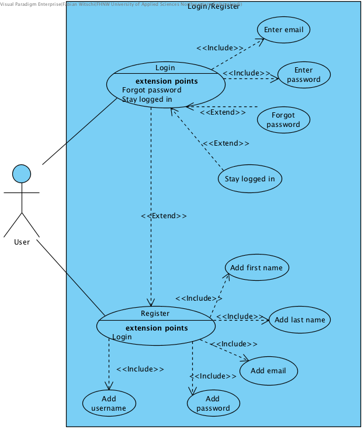
 
 

#### UC-2 Project Overview
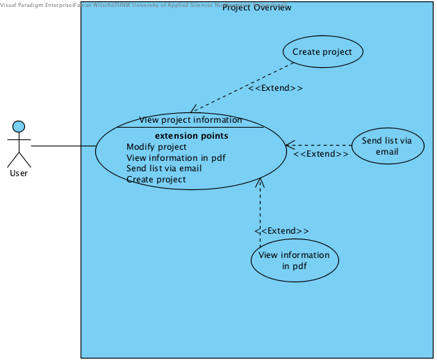
 
 

#### UC-3 Create Project
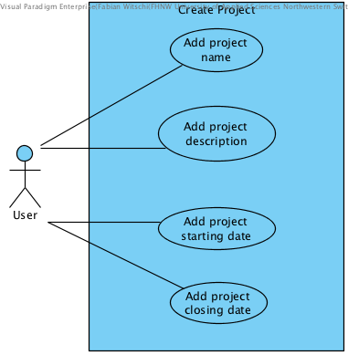
 
 

#### UC-4 Profile

 
 

## Design
The design is simple and with straight lines. The mookup were creating as Wireframes and than
implemented with CSS. However, behind the "scenes" is more than just the presentation layer. Therefore
the following two diagrams give a better insight in the layers architecture.
 
 

#### Information Systems Modelling
SOME TEXT TO ADD HERE
 
 

#### Information Systems (Layering) Architecture
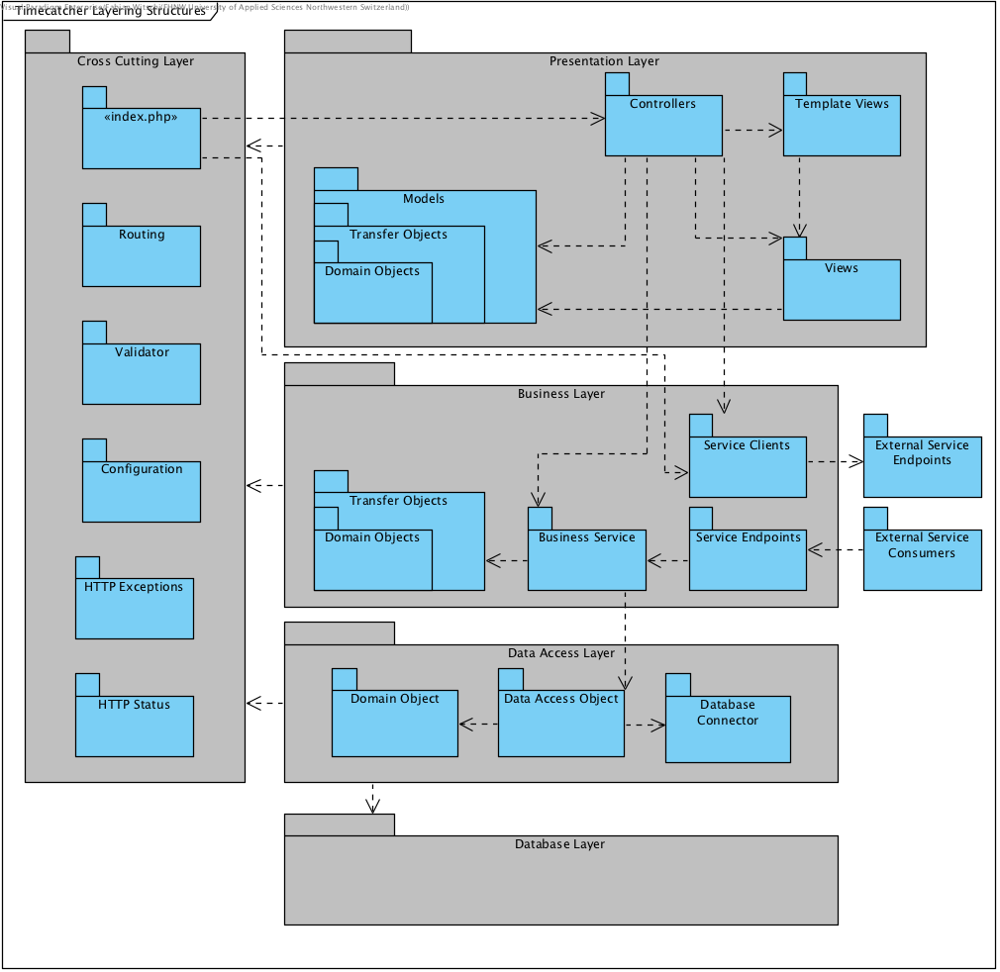
 
 

## Database

#### Entity Relationship Diagram (ERD)
See below the ERD for the web application.

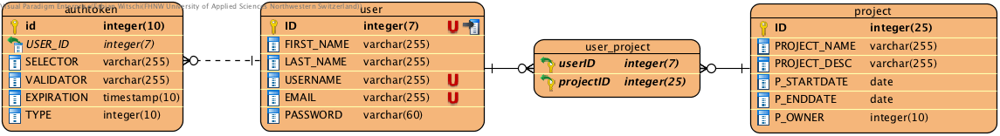
 

From this diagram the following SQL queries can be derived:
 

##### _SQL Table: user_
CREATE TABLE `user` (ID int(7) NOT NULL AUTO_INCREMENT, 
FIRST_NAME varchar(255) NOT NULL, 
LAST_NAME varchar(255) NOT NULL, 
USERNAME varchar(255) NOT NULL UNIQUE, 
EMAIL varchar(255) NOT NULL UNIQUE, 
PASSWORD varchar(60) NOT NULL, 
PRIMARY KEY (ID), 
UNIQUE INDEX (ID)); 

##### _SQL Table: authtoken_
CREATE TABLE authtoken (id int(10) NOT NULL AUTO_INCREMENT, 
USER_ID int(7) NOT NULL, 
SELECTOR varchar(255) NOT NULL, 
VALIDATOR varchar(255) NOT NULL, 
EXPIRATION timestamp NOT NULL, 
TYPE int(10) NOT NULL, 
PRIMARY KEY (id)); 
 

ALTER TABLE authtoken ADD INDEX FKauthtoken624332 (USER_ID), 
ADD CONSTRAINT FKauthtoken624332 FOREIGN KEY (USER_ID) REFERENCES `user` (ID); 
 

##### _SQL Table: project_
CREATE TABLE project (ID int(25) NOT NULL AUTO_INCREMENT, 
PROJECT_NAME varchar(255) NOT NULL, 
PROJECT_DESC text NOT NULL, 
P_STARTDATE date NOT NULL, 
P_ENDDATE date NOT NULL, 
P_OWNER varchar(255) NOT NULL, 
PRIMARY KEY (ID)); 
 

##### _SQL Table: user_project_
CREATE TABLE user_project (userID int(7) NOT NULL, 
projectID int(25) NOT NULL, 
 

ALTER TABLE user_project ADD INDEX FKuser_proje911728 (userID), 
ADD CONSTRAINT FKuser_proje911728 FOREIGN KEY (userID) REFERENCES `user` (ID); 

ALTER TABLE user_project ADD INDEX FKuser_proje200153 (projectID), 
ADD CONSTRAINT FKuser_proje200153 FOREIGN KEY (projectID) REFERENCES project (ID); 
 

## Implementation
After understanding and developing the fundamentals of the website the actual implementation can take
place. Therefore, the wireframe diagrams provide a good first impression of the design and the code
behind it can be checked in the folders above. Finally, the link to the Heroku deployment leads to
the final product of this project work.
 
 

#### Wireframe Diagrams
This section contains a few wireframe diagrams that demonstrate how the user interface looks (rough
estimation) and how they are connected to one antoher; in other words, what page is connected to
the another one. Note: Only pages that have valuable functions have been drawn into diagrams. 
However, almost all pages are available throughout the whole page thanks to a nav bar at the top.
 
 

##### _Initial Page_
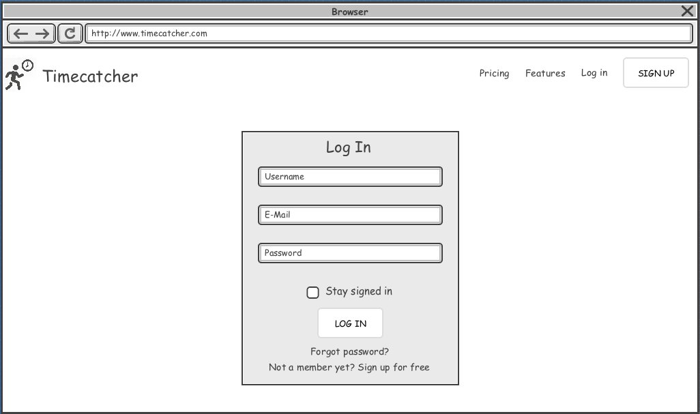
 
From this page, if you log in, you get to the project overview page - if you will have to register
you may get to the sign up page.
 
 

##### _Project Overview Page_
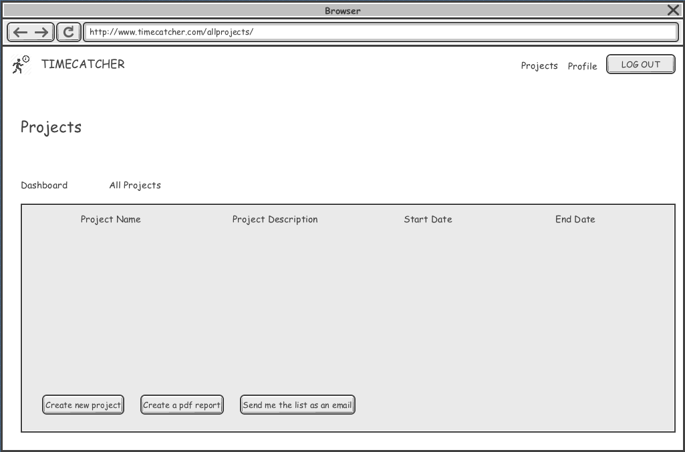
 
This page allows to get to the page "create project" or through "create pdf report" to a pdf view.
 
 

##### _Project Dashboard Page_
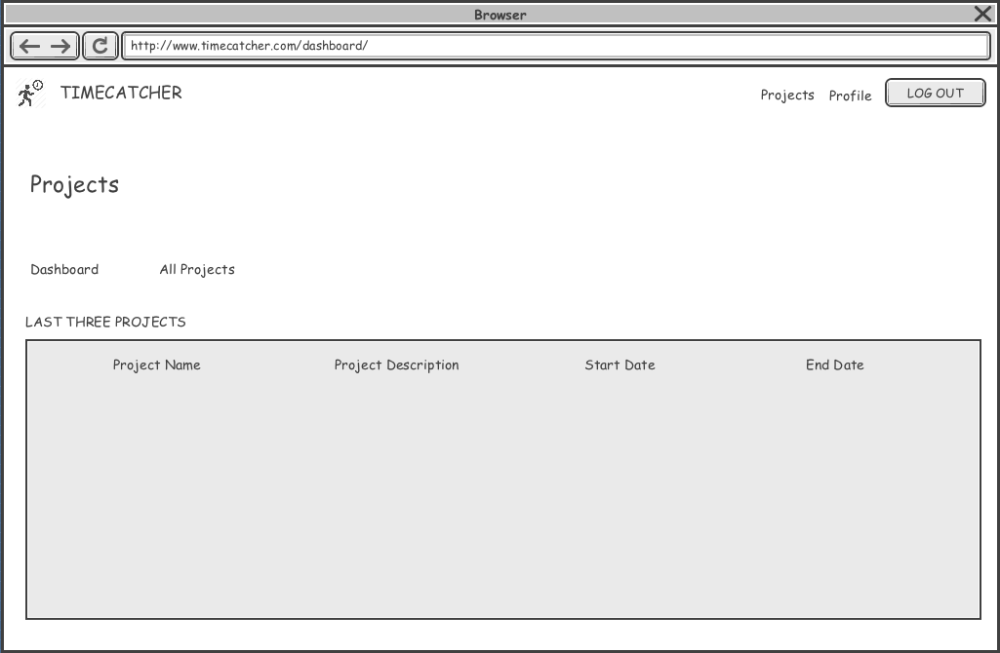
 
Allow you to see the last three projects.
 
 

##### _Sign Up Page_
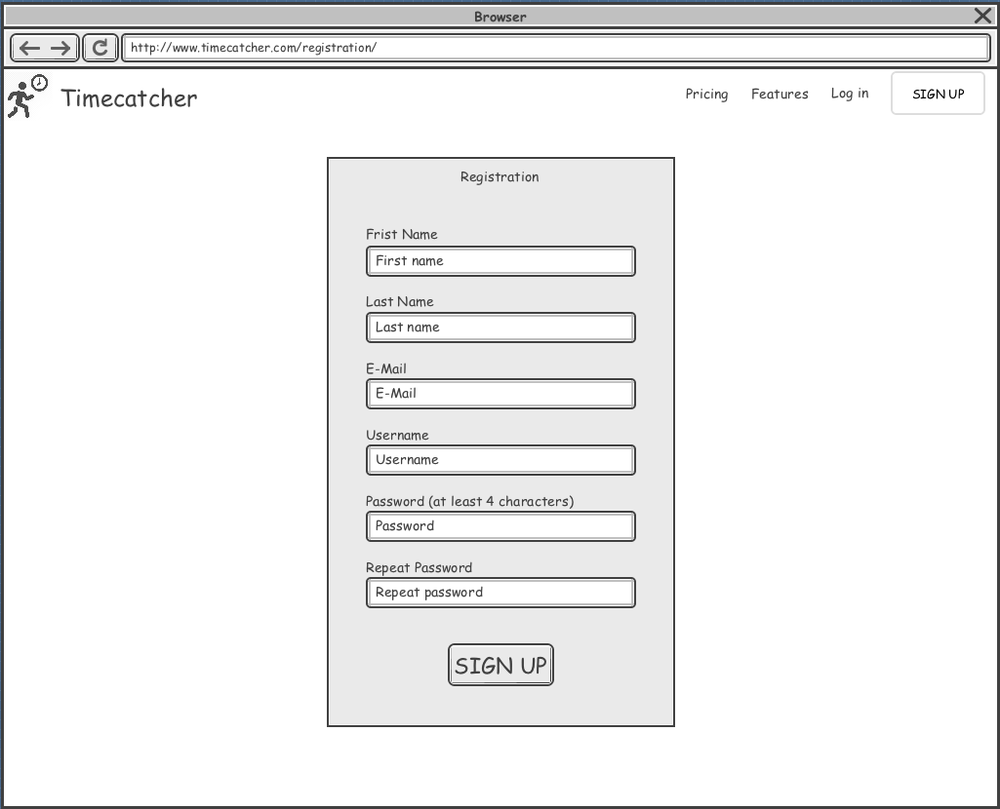
 
After signing up, you will get to the login page in order to log in properly.
 
 

##### _Create Project Page_
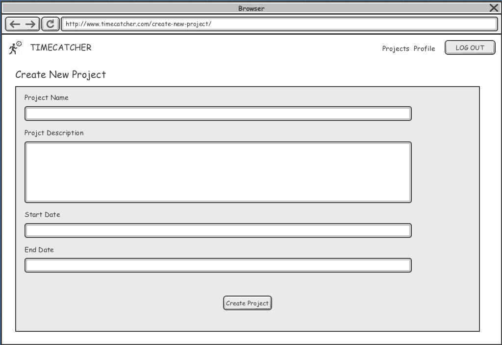
 
After you set all the required properties the new project is created.
 
 

##### _Profile Page_
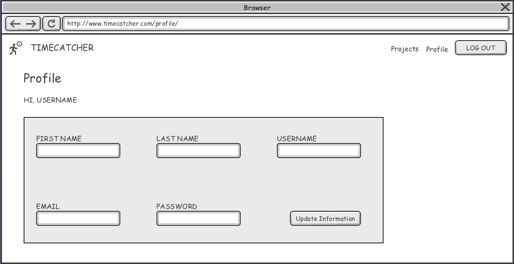
 
You may change your profile properties.
 
 

#### Heroku Link
Please find below the link to the deployed Heroku application and play around:
 
https://we-timecatcher.herokuapp.com/
 
 
HAVE FUN PLAYING WITH THE APP.